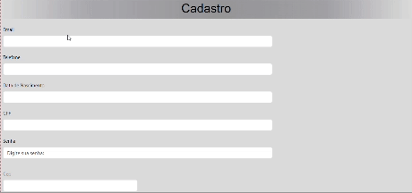

<h1 align="center"> 🚀Projeto-e-comerce</h1>

# Indice

[Descrição](#descri%C3%A7%C3%A3o)  
[Funcionalidades](#funcionalidades)  
[Tecnologias utilizadas](#tecnologias-utilizadas)  
[Fontes consultadas](#fontes-consultadas)  
[Autores](#autores)  

## 📝 Descrição
Este projeto consiste em uma tela de cadastro, com preenchimento automatico no qual solicita:
* Email
* Telefone
* Data de nascimento
* CPF
* Senha 
* CEP
* Rua 
* número 
* Bairro
* cidade
* estado

# :hammer:⚙️ Funcionalidades do projeto

- `1-Formulário de preenchimento`: Uma tela de cadastro de endereço geralmente inclui campos para os usuários inserirem informações, como nome CEP, endereço, cidade, numero, estado entre outros.
- `2-Validação de dados`: É importante ter validações nos campos para garantir que os dados inseridos sejam formatados corretamente. Verificar se o CEP é válido são exemplos de validação de dados.
- `3-Botão de envio ou registro`:Após preencherem todos os campos necessários, os usuários devem ter a opção de enviar o formulário e registrar-se no aplicativo ou sistema. Esse botão é responsável por enviar os dados do usuário para o processamento e, se tudo estiver correto, permitir que eles acessem o sistema.
- `4-Mensagens de erro`: Se houver algum problema durante o preenchimento ou envio do formulário, é importante exibir mensagens de erro claras e específicas para orientar os usuários a corrigirem os problemas encontrados.
- `5-Consulta de Endereço:` Ao preencher o campo de CEP, o sistema realiza uma consulta a uma API de serviço de CEP para obter as informações de endereço correspondentes. 
- `Preenchimento Automático:` Com base no CEP informado, o sistema preenche automaticamente os campos de endereço, facilitando o preenchimento do formulário. 

### 💻 Tecnologias utilizadas

- Git  

- GitHub  

- HTML5

- CSS3

- JavaScript3

- Vs Code   

- Bootstrap 

 
## 🔎 Fontes consultadas

* [O que é e-comerce](https://exame.com/invest/guia/o-que-e-e-commerce-red04/) 
* [lohhans](https://gist.github.com/lohhans/f8da0b147550df3f96914d3797e9fb89)

## 🙎🏽 Autores

**Ruan Pablo Do Prado Ribeiro**